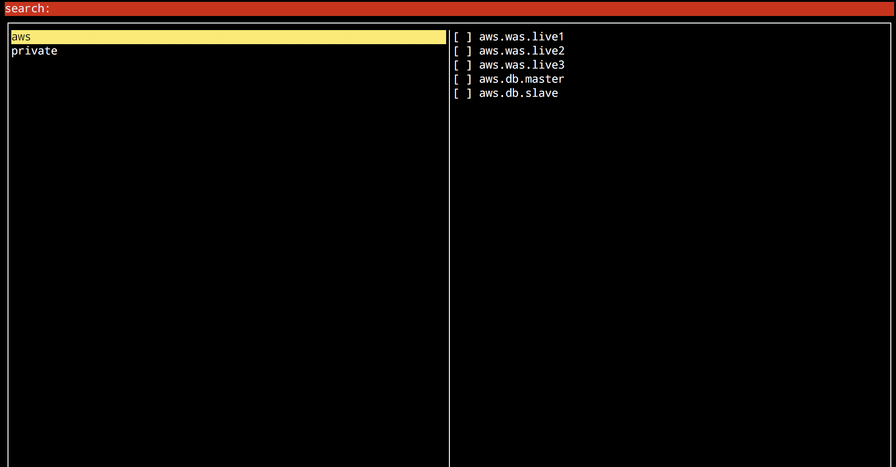

# remote-gazua

리모트-가즈아아ㅏㅏㅏㅏ를 사용하여 ssh를 쉽게 사용해보세요.

- 스크린샷

 

- 동영상으로 보기

[https://asciinema.org/a/BKhkAa4DiZfHnioKQAMO4YRXp](https://asciinema.org/a/BKhkAa4DiZfHnioKQAMO4YRXp)

## 요구사항

- python2.x, 3.x
- tmux

## 설정

`~/.ssh/config`에 규칙주석을 통해 그룹 설정을 할 수 있습니다.

`#gz:group=원하는 그룹명`을 적어주시면 해당주석의 아래 라인에 있는 Host들은 해당 그룹에 포함되게 됩니다.

예제)

```
#gz:group=live web server

Host live-web1
    HostName 123.123.123.123
    User ec2-user

Host live-web2
    HostName 123.123.123.124
    User ec2-user

#gz:group=live database

Host live-db-master
    HostName 123.123.123.123
    User ec2-user

Host live-db-slave
    HostName 123.123.123.124
    User ec2-user

```
